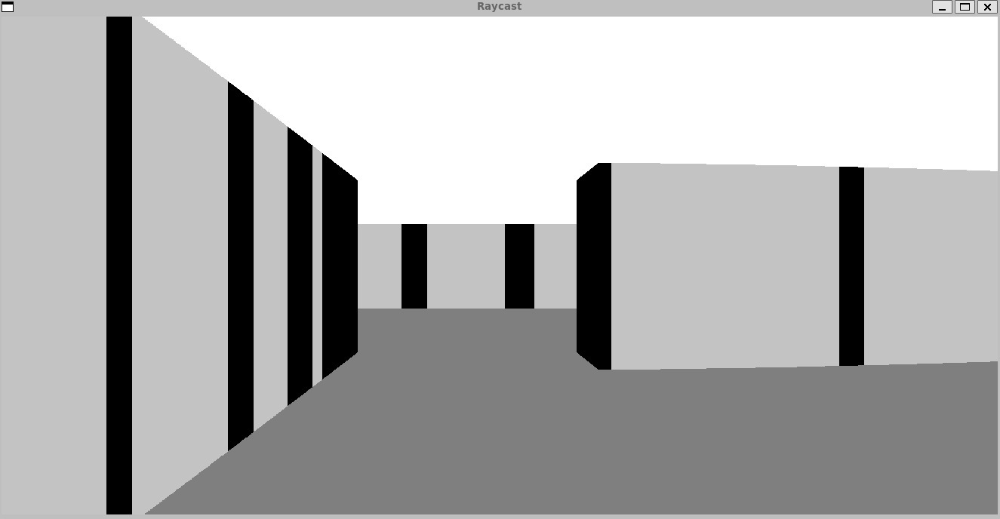

# Raycaster
Ray cast algorithm implementation based on SDL

## Brief
To compile:
```
g++ raycaster/main.cc raycaster/gamewindow.cc raycaster/raycast.cc -lSDL2
```
Makefile soon

- Only one feature is to walk around drown map in fake 3D space 

